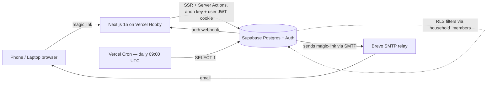

# Parents Financial Advisor — v1 Plan

## How to read this plan

Each section is tagged with a **Status**:
- 🔒 **LOCKED** — you've signed off; I won't re-open without being asked.
- 🟡 **DRAFT** — proposal stands but is open to iteration. Default for everything not yet discussed.
- 🟠 **NEEDS REVISION** — open issue called out; comment below the heading tells me what to change.
- ❓ **OPEN QUESTION** — I need an answer before I can finalize. I'll raise via AskUserQuestion.

Workflow I recommend for the rest of planning:
1. You skim a section, change its status, and (if NEEDS REVISION) drop a one-line comment under it.
2. I edit just that section and flip it to LOCKED.
3. Repeat until every section is LOCKED, then ExitPlanMode.

This keeps each round small and your input cheap.

## Context
Status: 🔒 LOCKED

A web app for two retirement-age households (parents + in-laws) to do **high-level** budgeting and planning. The user is the developer + admin. Real users will probably log in **once every 1–2 months** to answer questions like *"can we afford the Japan trip?"* or *"how are we doing this year?"* Not a transaction tracker — a planning tool.

Design constraints:
- Manual entry only, **summary-level** (monthly category totals; no per-line transactions).
- Hosting must be free.
- Privacy between households is non-negotiable.
- Non-technical users on phone + laptop.
- First-run experience must be **guided and linear** — they should not have to figure out what to do.
- Scales to ~10 households without re-architecting.

v1 surfaces:
1. **Monthly + annual budget vs actual** (categories like Groceries, Utilities).
2. **Big-ticket goals** — named planned spends like "Japan trip $10k", "New car $30k by 2027". This is where most discretionary money goes; first-class object, not buried in a category.
3. **Cash flow / retirement runway** — derived from monthly totals + net worth.
4. **Net worth snapshots** — manual balance entry per account, monthly cadence.

Repo is greenfield (single README); every file below is new.

## Architecture
Status: 🔒 LOCKED



Invariants:
- Every household-scoped table has a `household_id` column.
- All reads/writes go through RLS using the user's JWT.
- The service-role key stays server-only, used **only** in admin dashboard server actions and the auth-webhook handler.

## Stack
Status: 🔒 LOCKED

- **Next.js 15 (App Router) + TypeScript** on **Vercel Hobby**. Personal use, not commercial.
- **Supabase free**: Postgres + Auth (magic links) + RLS.
- **Tailwind + shadcn/ui** — shadcn copies component source into the repo, so we can override every default for older-user UX (font sizes, hit targets, contrast) without fighting a framework.
- **Brevo free SMTP** (300/day, no sender-domain verification required).
- **Server Actions** for all mutations; `revalidatePath` after writes.

## Database & auth platform — why Supabase, what we considered
Status: 🔒 LOCKED

You asked about cheaper / Vercel-native DB options like SQLite. Worth being concrete:

| Option | DB | Auth bundled? | Pauses? | Free quota | Notes |
|---|---|---|---|---|---|
| **Supabase free** (proposed) | Postgres | ✅ magic links, sessions, admin API, RLS | Yes, after 7d idle | 500 MB + 50k MAU | Daily heartbeat fixes pause. |
| Vercel Postgres | Postgres (Neon) | ❌ bring your own | Yes (Neon auto-suspend) | 256 MB | Same pause problem; adds auth complexity. |
| Neon free | Postgres | ❌ | Yes | 512 MB | Same as above. |
| Turso free | SQLite (libSQL) | ❌ | No (edge replicas) | 500 DBs, 9 GB | DB is great; you'd write all the auth glue. |
| Cloudflare D1 | SQLite | ❌ | No | 5 GB, 25M reads/day | Same: auth is on you. |
| Vercel KV / Redis | Key-value | ❌ | n/a | Tiny | Not a fit — relational queries needed. |

The Supabase win is **Auth, not the DB**. Magic links, session refresh, server-side cookie helpers (`@supabase/ssr`), refresh-token rotation, admin APIs for revocation, webhooks for audit — all bundled. Recreating that on SQLite means wiring Auth.js or Lucia + Brevo + a sessions table + revocation logic + audit hooks. That's roughly 2 days of net-new code with no business value.

If the 7-day pause is the only thing pushing you off Supabase, the daily heartbeat (1 line in `vercel.json`, 3-line API route) is the lower-cost fix. We can revisit if the app grows beyond free-tier limits.

## Auth + privacy — detailed
Status: 🔒 LOCKED (multi-user households, invites, admin dashboard, audit trail, and session revocation are all folded in).

This is the security spine. Three concerns that get conflated but are separate:

1. **Authentication** — proving who you are. Handled by Supabase Auth via magic link, delivered by Brevo SMTP.
2. **Authorization / privacy** — controlling what you can see. Handled by Postgres RLS keyed on **household membership** (a many-to-many relation, not a single column on `profiles`).
3. **Accountability** — knowing what was done by whom, and being able to cut off access. Handled by an `audit_log` table + admin dashboard + Supabase admin API.

### Households are multi-user

Multiple email addresses can belong to one household. v1 roles:

- `owner` — a family member of that household. Read/write on their own household. Can invite others to *their* household.
- `admin` — you (the developer). Read/write on every household, plus access to `/admin`. Not a row in `household_members`; it's a flag (`profiles.is_admin`).

Future roles (`viewer`, `accountant`, etc.) drop in by extending the role enum + RLS predicates; no schema rework required.

### Invite flow

1. Owner clicks "Invite" in Settings → enters invitee's email (optional — the link works without it) → server generates a 32-byte random token, stores hash in `household_invites` with `expires_at` (7 days) and `created_by`.
2. App shows the link `/join?token=…` for the owner to share via whatever channel they want. If they entered an email, we also send the link via Brevo.
3. Invitee opens link → if not signed in, magic-link login first → after auth, `/join?token=…` server action validates the token, creates `household_members` row with role `owner`, marks invite consumed.
4. Tokens are single-use, expirable, and revocable from `/admin`.

### Auth flow (step by step)

```
User → /login page
     ↓ enter email
     → supabase.auth.signInWithOtp({ email })
        ↓
        Supabase Auth generates one-time token
        ↓
        Supabase calls SMTP server (Brevo, configured in Auth → SMTP)
        ↓
        Brevo delivers the magic-link email to the user's inbox
     ←
User clicks link in email → /auth/callback?token=...
     ↓
     supabase.auth.exchangeCodeForSession(token)
        ↓
        Supabase Auth validates token, mints JWT + refresh token
     ←
     @supabase/ssr writes them into HttpOnly cookies
     ↓
User redirected to /budget — fully signed in
```

### Why Brevo (and what role it plays)

Supabase's *built-in* SMTP is shared infrastructure capped at **2 emails/hour** and is explicitly only for testing — they will throttle/block real apps. You have to point Supabase at *some* external SMTP. Options:

- **Brevo free** — 300/day, no domain verification, ~5 minute setup. Wins on setup cost.
- **Resend free** — 100/day but requires DNS-verified sender domain. More polished, more work.
- **AWS SES** — cheapest at scale, slow to provision, sandbox mode by default.

Brevo is the right v1 pick. Supabase doesn't talk to Brevo at runtime in any special way — it just uses Brevo's SMTP creds. If we ever outgrow it, swap creds; no app code changes.

### Session config (Supabase Auth dashboard)

- JWT (access token) expiry: 3600s (default).
- Refresh token rotation: ON.
- Inactivity timeout: **90 days**.
- Absolute time-box: **365 days**.

This is "stay logged in basically forever unless you don't open it for 3 months." Matches a 1-2x/month usage pattern — frequent re-auth would be a constant annoyance for older users.

(Re: your "hate?" comment — I meant *hate it*, as in dislike. Rewritten more plainly above.)

Tradeoffs and what mitigates each:
- **Stolen device = stolen session for up to a year.** User-facing mitigation: "Sign out everywhere" button calling `supabase.auth.signOut({ scope: 'global' })`. Admin-facing mitigation: see "Admin dashboard + revocation" below.
- **Destructive ops.** Delete-household, remove-member, etc. require a fresh re-auth challenge regardless of session age.

### Admin dashboard + revocation + audit trail

You (admin) need to see who's logging in, what they're doing, and cut off access at will. New surface:

- `/admin` route, gated on `profiles.is_admin = true`.
- **Households tab** — list each household, members, last sign-in, last activity. Per-member "Force sign-out" button calls `supabase.auth.admin.signOut(userId, { scope: 'global' })` via a server action using the service-role client (server-only).
- **Sessions tab** — list active sessions across all users (Supabase admin API: `auth.admin.listUsers()` + `listSessions(userId)`). Revoke individually.
- **Invites tab** — list outstanding `household_invites` with revoke buttons.
- **Audit log tab** — paginated viewer with filters (actor, action type, household, date range).

`audit_log` table writes happen at three layers:

1. **Sign-in events** — captured via a **Supabase Auth webhook** (`auth.user.signed_in`) → Next.js webhook handler at `/api/webhooks/supabase-auth` → inserts an `audit_log` row. Single source of truth; doesn't depend on client behavior.
2. **Sensitive mutations** — every server action that writes (create/edit/delete on accounts, goals, snapshots, invites, members) calls a `logAudit()` helper before returning.
3. **Admin actions** — same helper, with `actor_is_admin=true`.

Schema sketch (full version under Data model):

```sql
audit_log (
  id uuid pk,
  actor_profile_id uuid references profiles(id),
  actor_email text,           -- denormalized so the row stays readable after a user is deleted
  household_id uuid,          -- nullable for global/admin actions
  action_type text,           -- 'sign_in', 'sign_out', 'invite_created', 'member_removed',
                              -- 'account_created', 'snapshot_recorded', 'goal_updated',
                              -- 'session_revoked_by_admin', ...
  target_table text,          -- nullable
  target_id uuid,             -- nullable
  metadata jsonb,             -- shape varies by action_type; never PII beyond the email column
  ip_address inet,            -- best-effort from request headers
  user_agent text,
  created_at timestamptz default now()
)
```

RLS on `audit_log`: admin only. No regular user can read it (including their own rows) — keeps the dashboard honest and avoids leaking that another household exists.

### Privacy tenants (RLS)

Three rules enforced by Postgres, not by app code:

1. A user can only `SELECT/INSERT/UPDATE/DELETE` rows in households they're a member of.
2. Admin (you, via `profiles.is_admin = true`) bypasses #1.
3. Anonymous (signed-out) sessions see nothing.

Policy template applied to every household-scoped table:

```sql
USING (
  household_id IN (
    SELECT household_id FROM household_members
    WHERE profile_id = (SELECT auth.uid())
  )
  OR EXISTS (
    SELECT 1 FROM profiles WHERE id = (SELECT auth.uid()) AND is_admin
  )
)
```

Gotchas baked into the migration:
- Separate `SELECT/UPDATE/DELETE` policies (use `USING`) from `INSERT` policies (use `WITH CHECK`) — they aren't interchangeable.
- Wrap `auth.uid()` as `(SELECT auth.uid())` — known Supabase planner-caching tip.
- Service-role key stays server-only. Used **only** by the admin dashboard server actions (revoke-session, list-sessions) and the auth webhook handler. Never imported by user-facing routes.
- One Playwright test runs in CI: signs in as user A, fetches every API route, asserts that user B's data does not appear. RLS leaks are silent — automate the check.
- A second Playwright test confirms an `owner` cannot read `/admin/*`.

## Data model
Status: 🔒 LOCKED

All money stored as `_cents` integers (always positive; sign is conveyed by which table the row lives in, not by the value).

**Identity & access** (locked — see Auth section)

- `profiles` — `id` (= `auth.uid()`), `display_name`, `is_admin` boolean (only true for you).
- `households` — `id`, `name`, `created_at`, `created_by` (profile id).
- `household_members` — `household_id`, `profile_id`, `role` enum (`'owner'` for v1; reserved values: `'viewer'`, `'accountant'`), `joined_at`. Primary key `(household_id, profile_id)`.
- `household_invites` — `id`, `household_id`, `token_hash`, `email` (nullable), `created_by`, `created_at`, `expires_at`, `consumed_at` (nullable), `consumed_by` (nullable).

**Audit** (locked)

- `audit_log` — as sketched in the Auth section above. RLS: admin-read-only.

**Domain — assets & liabilities**

- `accounts` — `household_id`, `name`, `type` (enum: `checking` / `savings` / `investment` / `retirement` / `credit_card` / `mortgage` / `loan` / `other`), `is_liability` boolean, `current_balance_cents`. **Contract: `current_balance_cents` is a denormalized mirror of the most recent `account_snapshots.balance_cents` for that account. Maintained by the same server action that inserts a snapshot — never written independently.** For liabilities the balance is stored as a positive number; net worth math is `SUM(assets) − SUM(liabilities)`. `is_liability` is the source of truth (rather than inferring from `type`) so the `other` type can be either.
- `account_snapshots` — `account_id`, `balance_cents`, `snapshot_date`. Unique on `(account_id, snapshot_date)`. Multiple snapshots per month are allowed (catch-up entries).
- **Account creation rule:** the onboarding "Add accounts" step and the Settings "Add account" form both call a single server action that inserts the `accounts` row and the initial `account_snapshots` row (dated today) atomically. There is no path to create an account without a snapshot.

**Domain — budgeting (expenses)**

- `budget_categories` — `household_id`, `name`, `monthly_budget_cents` (nullable), `annual_budget_cents` (nullable). Expense categories only. Seeded with ~10 defaults (Groceries, Utilities, Housing, Transport, Healthcare, Insurance, Dining, Entertainment, Gifts, Misc) by SQL function `seed_default_categories(household_id uuid)` defined in `0002_domain.sql`. Invoked from the onboarding server action immediately after the `households` row is created. Same function is callable from `/admin` for repair.
- `category_actuals` — `household_id`, `category_id`, `year`, `month` (1–12), `amount_cents`. One row per category per month. Unique on `(category_id, year, month)`.

**Domain — budgeting (income)**

- `income_streams` — `household_id`, `name` ("Social Security", "Pension", "401k withdrawal", "Dividends"), `expected_monthly_cents` (nullable, used for projection). Stable list users edit only when their situation changes.
- `income_actuals` — `household_id`, `income_stream_id`, `year`, `month` (1–12), `amount_cents`. Same shape as `category_actuals` so the monthly update wizard stays symmetric.

**Domain — goals**

- `goals` — `household_id`, `name` ("Japan trip"), `target_amount_cents`, `target_date` (nullable), `saved_cents` (manual), `status` (`planning`/`saving`/`booked`/`done`/`cancelled`), `notes`.

**Derived numbers**

- Net worth = `SUM(accounts.current_balance_cents) WHERE is_liability=false` − `SUM(accounts.current_balance_cents) WHERE is_liability=true`. (No window function needed at read time — the mirror column is the cache.)
- Monthly cash flow = `SUM(income_actuals) − SUM(category_actuals)` for a given (year, month).
- Annual cash flow = same, rolled up to year.
- Budget vs actual = compare `category_actuals` to `budget_categories.monthly_budget_cents` / `annual_budget_cents`.

## Implementation phasing
Status: 🔒 LOCKED

**Phase 1 — Foundation (ready to build; depends only on LOCKED sections).** No UI flows that touch budgeting/goals yet; this gets identity, multi-tenant safety, and the deploy pipeline solid before we paint anything.

1. Scaffold: `pnpm create next-app`, Tailwind, shadcn init, env vars.
2. Supabase project + Brevo SMTP wired up (operational steps).
3. Migration `0001_init.sql`: identity + access + audit tables (`profiles`, `households`, `household_members`, `household_invites`, `audit_log`). RLS policies on all of them.
4. `@supabase/ssr` clients (`lib/supabase/{server,client,middleware}.ts`) + root `middleware.ts` (refresh-token rotation + auth gate).
5. `/login` magic link + `/auth/callback` route.
6. `/api/webhooks/supabase-auth` writing sign-in / sign-out rows to `audit_log`.
7. `/join?token=…` invite redemption.
8. `lib/audit.ts` helper.
9. `/admin` dashboard skeleton (households / sessions / invites / audit tabs) using service-role server actions.
10. Vercel Cron heartbeat (`/api/heartbeat`, `vercel.json`).
11. First Playwright RLS test (cross-household isolation + admin-route gating) — runs against a separate test Supabase project in CI.
12. Deploy to Vercel preview; confirm magic-link email arrives via Brevo end-to-end.

Phase 1 deliverable: you and one family member can each sign in, you can see their household from `/admin`, and you can revoke their session. No financial features yet, but the spine is verified.

**Phase 2 — Domain (iterate in parallel with Phase 1).** Migration `0002_domain.sql` lands once the domain data model is locked. UI builds on top:

- Accounts CRUD (Settings) + monthly snapshot wizard (Net Worth tab).
- Income + expense category CRUD (Settings) + monthly actuals wizard (Budget tab).
- Goals CRUD (Goals tab).
- First-run onboarding stepper wiring all of the above together.

We can iterate on the domain schema while Phase 1 ships. Anything that lands in Phase 1 has zero dependency on which way the budgeting tables ultimately shake out.

## Hosting gotchas
Status: 🔒 LOCKED

- **Supabase free pauses after 7 days of zero DB activity.** First request after pause = 30–60s cold error. Fix: `app/api/heartbeat/route.ts` runs `SELECT 1`; Vercel Cron hits it daily at 09:00 UTC. Hobby cron is **daily-frequency only** — "every 3 days" is not a valid Hobby schedule, so we just do daily.
- **Vercel Hobby = personal use only.** Helping family qualifies. Noted.

## UI — older-user rules
Status: 🔒 LOCKED

- Base font **18–20px**. Buttons min **56px tall**.
- WCAG AAA contrast (7:1).
- No hover-only affordances.
- **No hamburger menu.** Flat bottom tab bar: **Budget · Goals · Net Worth · Settings**. (Cash-flow lives inside Budget as a summary card; standalone tab is overkill.)
- Destructive actions confirm in a full modal, not a toast.
- Money formatted **`$1,234`** on dashboards; cents only on edit screens.
- Icons always paired with text labels.
- One primary (blue) action per screen.

## First-run guided setup
Status: 🔒 LOCKED

Linear stepper, finishable in <5 minutes, can't be skipped on first visit:

1. **Welcome** — one paragraph in plain language.
2. **Name your household** — text input. Server action creates the `households` row, adds the user to `household_members` as `owner`, and seeds default categories via `seed_default_categories(household_id)`.
3. **Add your accounts** — repeat-add UI for accounts + current balance. "Skip for now" allowed.
4. **Review default categories** — show seeded list with current monthly budget defaults, let them edit numbers or remove rows. "Looks good" continues.
5. **Add a goal** (optional) — "Anything big coming up? Trip, car, repair?" Single-row form.
6. **Done** — drops them on the Budget tab with a non-dismissable banner: *"This month is empty. Add your first month's totals when you're ready."*

After first run, returning users always land on Budget. The wizard re-appears only if `accounts` is empty.

## Monthly "Update" pattern
Status: 🔒 LOCKED

Two short wizards, surfaced as dashboard banners when overdue:

- **Update balances** (net worth) — one screen per account: *"Chase Checking: last $4,200 on Apr 15. Today?"* Writes `account_snapshots` + updates `accounts.current_balance_cents`.
- **Update last month's spending** — one screen per category: *"Groceries — about how much in April?"* Writes `category_actuals`.

**Overdue rule:** banners appear after the 7th of the current month. Balance banner shows when any account has no `account_snapshots` row dated this month (so updating one of five accounts doesn't dismiss the banner — it stays until all are current). Spending banner shows when any active `budget_categories` row has no `category_actuals` row for the previous (year, month).

Both are skippable per-step. Designed so a user who logs in after 2 months can catch up in 3 minutes.

No email reminders. They'll come back when they need the app.

## Files to create (in order)
Status: 🔒 LOCKED

1. `package.json`, `tsconfig.json`, `next.config.ts`, `tailwind.config.ts`, `postcss.config.js` — scaffold via `pnpm dlx create-next-app`.
2. `supabase/migrations/0001_init.sql` — identity + access + audit schema, RLS policies. Foundation; built and tested before any UI.
3. `supabase/migrations/0002_domain.sql` — domain tables (accounts, snapshots, categories, actuals, income, goals), `seed_default_categories(household_id)` function, RLS policies.
4. `lib/supabase/{server,client,middleware}.ts` — `@supabase/ssr` clients.
5. `middleware.ts` — refresh-token rotation + auth gate.
6. `app/(auth)/login/page.tsx` + `app/auth/callback/route.ts` — magic-link flow.
7. `app/api/heartbeat/route.ts` + `vercel.json` — DB-pause prevention cron.
8. `app/globals.css` + `tailwind.config.ts` — theme overrides (font sizes, contrast, hit targets).
9. `app/(app)/layout.tsx` — bottom tab bar shell.
10. `app/(app)/onboarding/page.tsx` + `app/(app)/onboarding/actions.ts` — first-run stepper; actions file handles household creation + seed-categories + atomic account-plus-initial-snapshot creation.
11. Feature pages (each with colocated `actions.ts`):
    - `app/(app)/budget` — current month + annual rollup + "Update last month" wizard.
    - `app/(app)/goals` — list + create/edit big-ticket goals.
    - `app/(app)/net-worth` — chart + "Update balances" wizard.
    - `app/(app)/settings` — household name, accounts, categories CRUD, **invite members**, leave-household.
12. `app/(app)/join/page.tsx` — invite-token redemption.
13. `app/api/webhooks/supabase-auth/route.ts` — receives Supabase Auth webhook, writes `audit_log` rows for sign-in / sign-out events.
14. `lib/audit.ts` — `logAudit({ action, householdId?, targetTable?, targetId?, metadata })` helper used by every mutation server action.
15. `app/(admin)/admin/{households,sessions,invites,audit}/page.tsx` — admin dashboard tabs.
16. `app/(admin)/admin/actions.ts` — server actions for revoke-session, revoke-invite, remove-member, all writing audit rows.
17. `tests/rls.spec.ts` — Playwright cross-household isolation + admin-route gating tests.

## Operational setup (outside the repo)
Status: 🔒 LOCKED

- Create Supabase project (free tier, US region).
- Create Brevo account, generate SMTP creds, paste into Supabase Auth → SMTP settings.
- Rewrite Supabase magic-link email template into plain language.
- Set session inactivity to 90d, time-box to 365d.
- Vercel project linked to repo. Env vars:
  - `NEXT_PUBLIC_SUPABASE_URL`
  - `NEXT_PUBLIC_SUPABASE_ANON_KEY`
  - `SUPABASE_SERVICE_ROLE_KEY` (server-only).
- After first login as yourself, manually flip `is_admin = true` on your `profiles` row via Supabase SQL editor.
- In Supabase Auth → Webhooks, point `auth.user.signed_in` (and `signed_out`) at `https://<app>/api/webhooks/supabase-auth`.
- From `/admin`, create the two households and send invite links to each parent/in-law's email.

## Verification
Status: 🔒 LOCKED

End-to-end smoke test before sharing the URL:

1. `pnpm dev`, sign up via magic link, confirm cookie session survives a browser restart.
2. Walk through first-run wizard end-to-end as a brand-new user.
3. Run Playwright RLS test — log in as user A, assert user B's data is invisible across every API route.
4. Populate a few months of `category_actuals`, a goal, a couple of account snapshots; confirm budget rollups and net-worth chart are correct.
5. Switch to admin user; confirm visibility into both households, ability to revoke a session, and that the audit log shows sign-in + the revocation event.
6. Invite a second user into a household via the link, confirm membership lands correctly and they cannot see the other household.
7. Walk through both monthly "Update" wizards.
8. Deploy to Vercel preview; verify magic-link emails arrive via Brevo (check spam folder, tune From-name and reply-to).
9. Test on a real phone: tap targets right, fonts readable at arm's length.
10. After 24h, confirm Vercel Cron heartbeat fired (Vercel logs) and Supabase logged the `SELECT 1`.

## Out of scope for v1
Status: 🔒 LOCKED

- Per-transaction tracking.
- Bank sync (Plaid/Teller).
- Recurring bills auto-materialization.
- Additional roles beyond `owner` + `admin` (`viewer`, `accountant`, etc. — schema supports them; UI does not).
- Multi-currency.
- Email/push reminders.
- Reports / CSV exports.
- Mobile app wrapper.
